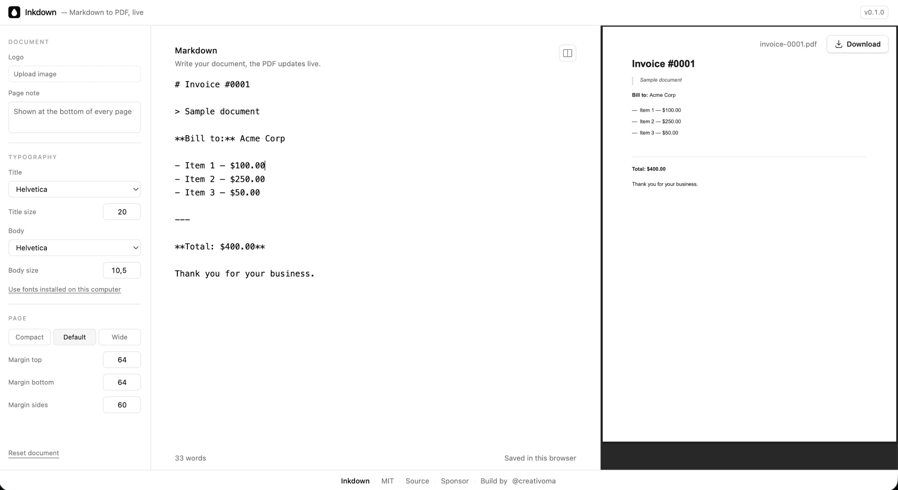

# Inkdown

Markdown to PDF, live. Write Markdown on the left, get a clean typeset PDF on the
right, and download it. Everything runs in the browser — no uploads, no account,
no server.

[Live app](https://inkdown-nine.vercel.app) ·
[Sponsor](https://github.com/sponsors/creativoma)



## Features

- **Live preview that never flashes.** The document renders into a hidden iframe
  and is swapped in only once the browser finished painting it, and re-rendering
  waits until you pause typing.
- **Balanced titles.** `text-wrap: balance` does not exist in the PDF renderer,
  so Inkdown measures every heading with the real font metrics and pre-wraps it
  into even lines. Words are never hyphenated mid-break.
- **Markdown**: headings, bold, italic, links, images, ordered and unordered
  lists, blockquotes, tables and horizontal rules. Links (`[text](url)` and bare
  URLs) stay clickable in the PDF.
- **Paste images**: `⌘/Ctrl + V` with an image on the clipboard inserts it on its
  own line as ``. The image is kept with the draft rather
  than inlined as base64, so the Markdown stays readable.
- **Page breaks that hold together**: a list item or table row is never split
  across two pages.
- **Typography**: separate title and body family, sizes, link color, and page
  margins with Compact / Default / Wide presets.
- **Logo** in any format the browser can open (PNG, JPG, WebP, GIF, SVG…) with
  adjustable size. The PDF renderer only embeds PNG and JPEG, so other formats
  are converted to PNG, and SVG is rasterized at 3× so it stays sharp.
- **Page note**: a small line repeated at the bottom of every page, for
  confidentiality notices, validity dates or contact details.
- **Nothing is lost**: draft, settings and pasted images are saved in your
  browser and restored on the next visit. Browser storage is capped at a few MB,
  so many large images can stop the draft from saving.
- The PDF is named after the document's first heading, and `⌘/Ctrl + S`
  downloads it.

## Fonts

Four open-source families ship with the app (`public/fonts`, downloaded only when
selected): [Inter](https://github.com/rsms/inter),
[Lora](https://github.com/cyrealtype/Lora-Cyrillic),
[EB Garamond](https://github.com/octaviopardo/EBGaramond12) and
[JetBrains Mono](https://github.com/JetBrains/JetBrainsMono) — all under the
[SIL Open Font License 1.1](https://openfontlicense.org/). The PDF base-14 faces
(Helvetica, Times, Courier) need no download at all.

In Chrome and Edge, "Use fonts installed on this computer" reads your system
fonts through the Local Font Access API and embeds the one you pick. The font
files stay on your machine — like everything else here, nothing is uploaded.
Families without a bold or italic face reuse their regular one — the PDF renderer
resolves style and weight together and fails on a missing combination rather than
faking it. A local font is not remembered across reloads: the draft falls back to
Helvetica until you grant access again.

## Development

```bash
bun install
bun dev
```

Then open [http://localhost:3000](http://localhost:3000).

| Script           | Description          |
| ---------------- | -------------------- |
| `bun dev`        | Start the dev server |
| `bun run build`  | Production build     |
| `bun run lint`   | Lint with ESLint     |
| `bun run format` | Format with Prettier |

Set `NEXT_PUBLIC_SITE_URL` to the deployed origin so canonical URLs, the sitemap
and OG tags point at the right host. The version shown in the header comes from
`package.json`.

### Layout

```
src/
  app/                 page shell, metadata, icons, robots + sitemap
  components/
    editor.tsx         client-only app: state, draft, panes
    pdf-preview.tsx    double-buffered iframe preview + download
    settings-sidebar.tsx
    pdf/               the PDF document and its styles
  lib/
    markdown.ts        the small Markdown parser
    balance.ts         font-metric line balancing for headings
    fonts.ts           bundled + local font registration
    images.ts          image conversion to PDF-ready PNG
    storage.ts         localStorage draft
```

## Stack

Next.js 16, React 19, Tailwind CSS 4 and
[@react-pdf/renderer](https://react-pdf.org/).

## License

[MIT](./LICENSE) © [Mariano Alvarez](https://marianoalvarez.dev/)
